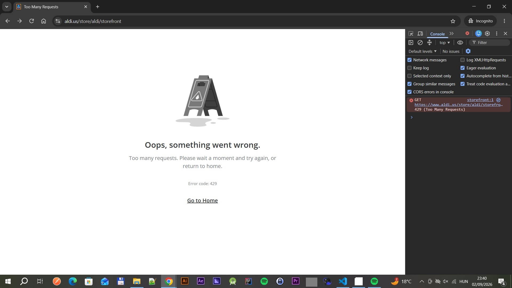
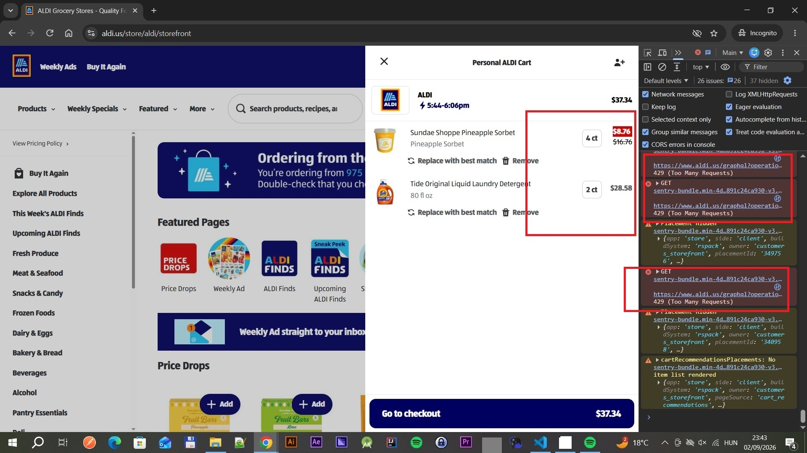

# Task 1: Manual Testing — ALDI US "Add to Shopping List"

## Test Cases (Gherkin / BDD Format)

### Test Case 1: Add a Single Product to the Shopping List

| Field | Value |
| --- | --- |
| ID | TC-SL-001 |
| Feature | Add to Shopping List |
| Priority | High |
| Type | Functional / Positive |
| Preconditions | User is logged in; at least one product is available on aldi.us |
| Test Data | Any in-stock product (e.g., "ALDI Dark Roast Coffee") |
| Environment | Chrome latest / Windows 10 |

```gherkin
Feature: Add to Shopping List
  As a logged-in ALDI US user
  I want to add a product to my shopping list
  So that I can save items I intend to purchase

  Background:
    Given the user is on the ALDI US website "https://aldi.us"
    And the user is logged in with valid credentials

  Scenario: Add a single product to the shopping list
    Given the user navigates to a product detail page for "ALDI Dark Roast Coffee"
    When the user clicks the "Add to List" button
    Then the product "ALDI Dark Roast Coffee" should be added to the shopping list
    And a confirmation message "Item added to your list" should be displayed
    And the shopping list icon counter should increment by 1
```

---

### Test Case 2: Add a Product While Not Logged In, Then Attempt Checkout

| Field | Value |
| --- | --- |
| ID | TC-SL-002 |
| Feature | Add to Shopping List |
| Priority | High |
| Type | Functional / Negative |
| Preconditions | User is NOT logged in (guest/anonymous session) |
| Test Data | Any visible product on the homepage or category page (e.g., "ALDI Dark Roast Coffee") |
| Environment | Chrome latest / Windows 10 |

```gherkin
Feature: Add to Shopping List — Unauthenticated User

  Background:
    Given the user is on the ALDI US website "https://aldi.us"
    And the user is not logged in

  Scenario: Guest can add a product but is redirected to login at checkout
    Given the user navigates to a product detail page for "ALDI Dark Roast Coffee"
    When the user clicks the "Add to List" button
    Then the product "ALDI Dark Roast Coffee" should be added to the shopping list
    And a confirmation message "Item added to your list" should be displayed
    And the shopping list icon counter should increment by 1
    When the user opens the cart
    And the user clicks "Proceed to Checkout"
    Then the user should be redirected to the login page as a full page navigation
    When the user logs in with valid credentials
    Then the previously added product "ALDI Dark Roast Coffee" should still be in the cart
    And the user should be able to continue to checkout
```

---

### Test Case 3: Add Multiple Products and Verify the Shopping List

| Field | Value |
| --- | --- |
| ID | TC-SL-003 |
| Feature | Add to Shopping List |
| Priority | Medium |
| Type | Functional / Positive |
| Preconditions | User is logged in; shopping list is empty at test start |
| Test Data | Product A: "ALDI Dark Roast Coffee", Product B: "ALDI Whole Milk", Product C: "ALDI Sourdough Bread" |
| Environment | Chrome latest / Windows 10 |

```gherkin
Feature: Add Multiple Products to the Shopping List

  Background:
    Given the user is on the ALDI US website "https://aldi.us"
    And the user is logged in with valid credentials
    And the user's shopping list is empty

  Scenario: Add multiple products and verify all appear in the shopping list
    Given the user navigates to the product page for "ALDI Dark Roast Coffee"
    When the user clicks the "Add to List" button
    Then "ALDI Dark Roast Coffee" should appear in the shopping list

    Given the user navigates to the product page for "ALDI Whole Milk"
    When the user clicks the "Add to List" button
    Then "ALDI Whole Milk" should appear in the shopping list

    Given the user navigates to the product page for "ALDI Sourdough Bread"
    When the user clicks the "Add to List" button
    Then "ALDI Sourdough Bread" should appear in the shopping list

    When the user opens the shopping list
    Then the list should contain exactly 3 items
    And the list should include "ALDI Dark Roast Coffee"
    And the list should include "ALDI Whole Milk"
    And the list should include "ALDI Sourdough Bread"
    And the total item count displayed should equal 3
```

---

## Bug Reporting

### Bug report field definitions

| Field | Purpose |
| --- | --- |
| Bug ID | Unique identifier in the tracker |
| Summary | One-line "what / where / impact" |
| Environment | Browser + version, OS, session type, URL, date/time |
| Severity | Technical impact: Critical / Major / Minor / Trivial |
| Priority | Business urgency to fix: P1–P4 |
| Preconditions | Required starting state |
| Steps to Reproduce | Minimal, numbered (Given / When / Then) |
| Expected Result | Correct behaviour |
| Actual Result | Observed (wrong) behaviour, incl. console/network evidence |
| Reproducibility | Always / Intermittent (x of y) / Once |
| Evidence | Screenshots, recordings, console/network logs |
| Workaround | Any way for the user to recover |
| Notes | HTTP responses, correlation IDs, related tickets |

### Sample bug

| Field | Value |
| --- | --- |
| Bug ID | ALDI-SL-201 |
| Summary | Rapidly opening/closing the cart while changing item quantities leaves the cart UI in a broken state (item counter not rendered) or drops the user on the "Too many requests" (HTTP 429) error page |
| Environment | Chrome latest (Incognito) / Windows 10 / guest session / `https://www.aldi.us/store/aldi/storefront` / 2026-09-02 ~23:40 |
| Severity | Major (core shopping flow can be driven into an unrecoverable-looking state; blocks reaching checkout) |
| Priority | P2 |
| Preconditions | User has at least two products in the cart |
| Steps to Reproduce | 1. **Given** the user has added several items to the cart.<br>2. **When** the user opens the cart, changes an item's quantity, and closes the cart again very quickly — repeating the open / change / close cycle a few times in rapid succession.<br>3. **Then** on reopening the cart the item-count badge / totals fail to render, and/or the storefront navigates to the full-page error "Oops, something went wrong. Too many requests. Error code: 429". |
| Expected Result | The client should debounce / throttle and serialise cart mutation and cart-panel requests so rapid user interaction cannot exceed rate limits. The user must not be able to break the flow: the cart panel should always render a consistent, complete state, and no user-driven interaction should surface an HTTP 429 error page. |
| Actual Result | DevTools console/network shows repeated `429 (Too Many Requests)` responses for `GET .../store/aldi/storefront` and `GET .../graphql` cart calls. The cart panel renders partially (line items visible but the header item counter / roll-up is missing), and a subsequent open of the cart redirects to the 429 error page. Recovery requires waiting and reloading. |
| Reproducibility | Intermittent — reliably reproducible with sufficiently fast repeated open/close + quantity changes (~4 of 5 attempts) |
| Evidence | See screenshots below. |
| Workaround | Wait ~30–60 seconds without interacting, then reload the page; the cart contents themselves are not lost. |
| Notes | Root cause likely client-side: no throttling/cancellation of in-flight cart requests, so each rapid open/close fires a new storefront + GraphQL fetch and trips the server rate limiter (429). The error page is a generic 429 handler with no automatic retry. Related area: cart item-counter render depends on a response that may have been rate-limited. |

#### Evidence

**1. "Too many requests" (HTTP 429) error page** — console shows the failed `GET .../store/aldi/storefront` request returning `429 (Too Many Requests)`.



**2. Cart panel with missing item counter** — line items render but the header counter / roll-up is absent; console shows repeated `429 (Too Many Requests)` responses on `graphql` and `sentry-bundle` calls.


